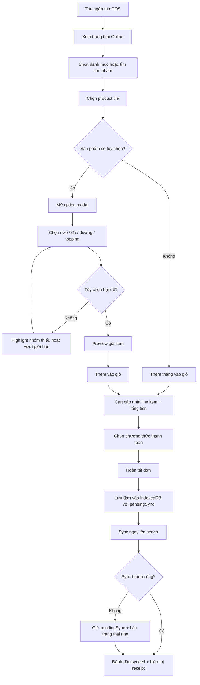
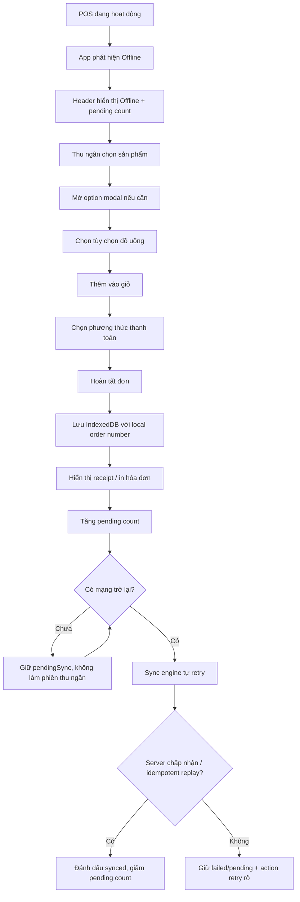
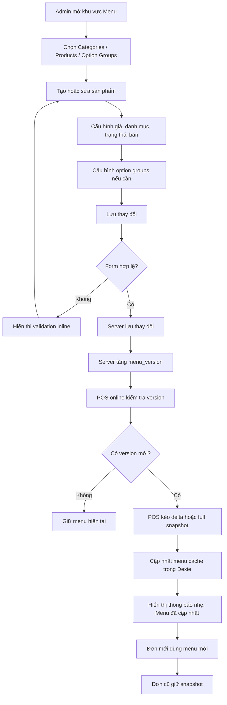
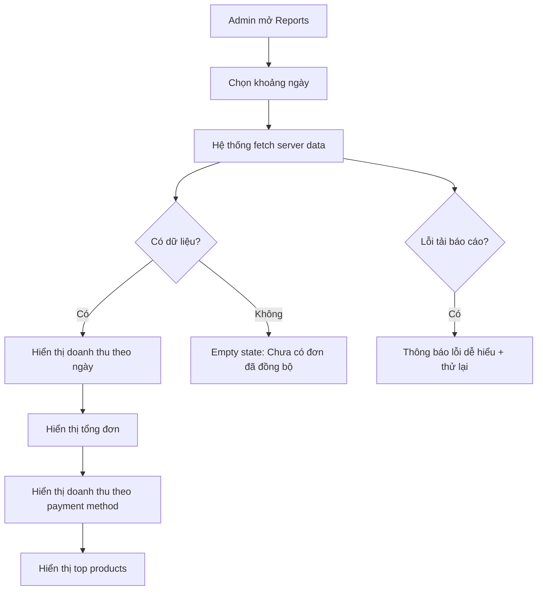
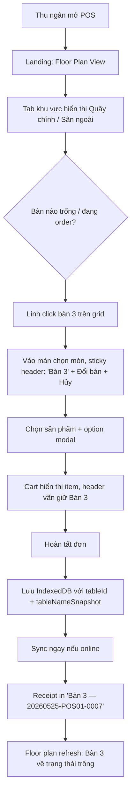
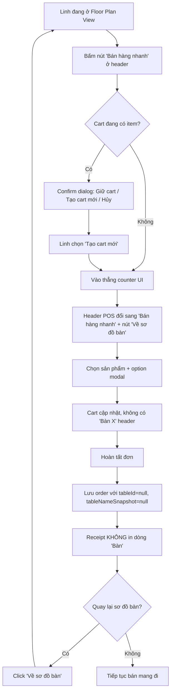

# UX Design Specification pos-bmad

**Tác giả:** Tuan.nguyen
**Ngày:** 2026-05-09

---

<!-- Nội dung thiết kế UX sẽ được bổ sung tuần tự qua các bước workflow cộng tác -->

## Executive Summary

### Project Vision

Café POS MVP là trải nghiệm bán hàng offline-first cho quán cà phê nhỏ, tối ưu cho tốc độ xử lý tại quầy và độ tin cậy khi mạng không ổn định. Sản phẩm cần giúp thu ngân tiếp tục bán hàng tự tin dù online hay offline, đồng thời giúp admin quản lý menu và xem báo cáo cơ bản từ dữ liệu đã đồng bộ.

### Target Users

Người dùng chính là thu ngân làm việc tại quầy trên tablet landscape hoặc laptop nhỏ, cần thao tác nhanh, ít bước và nhìn rõ trạng thái hệ thống trong giờ cao điểm. Sản phẩm phục vụ **hai mô hình vận hành F&B**: (1) **counter-service** — thu ngân bán hàng tại quầy, khách mang đi; (2) **table-service** — thu ngân phục vụ khách tại bàn, mỗi order gắn với một bàn cụ thể. Một store có thể bật/tắt chế độ bàn qua `tableMode`, và ngay trong store có `tableMode=true` vẫn có thể bán hàng nhanh (mang đi) qua flow phụ. Người dùng thứ hai là admin/chủ quán, cần quản lý sản phẩm, danh mục, tùy chọn, **khu vực và bàn**, cấu hình mode store, và báo cáo doanh thu mà không cần kiến thức kỹ thuật. Ngoài ra, MVP cần hỗ trợ developer/demo user setup và trình diễn luồng offline-sync một cách rõ ràng.

### Key Design Challenges

- Thiết kế màn hình POS hai cột rõ ràng, thao tác nhanh, phù hợp tablet landscape và laptop nhỏ.
- Làm cho trạng thái offline, pending sync, sync failed và sync success dễ hiểu, đáng tin cậy, không gây lo lắng cho thu ngân.
- Tối ưu modal tùy chọn đồ uống để chọn size, đá, đường, topping nhanh mà vẫn tránh lỗi.
- Giữ khu vực Admin đủ đơn giản cho chủ quán nhỏ nhưng vẫn hỗ trợ CRUD menu, sắp xếp, bật/tắt sản phẩm và báo cáo.
- Đảm bảo receipt, mã đơn cục bộ và thông tin thanh toán rõ ràng cả khi offline.
- **Dual-mode UX:** thiết kế floor-plan landing và sticky bàn header sao cho table-service cảm thấy là **mode mặc định** trong store F&B, nhưng quick-counter ("Bán hàng nhanh") luôn cách thu ngân một chạm để phục vụ khách mang đi.
- **Mode toggle backward compatible:** store đang ở counter-service (`tableMode=false`) tuyệt đối không thấy bất kỳ floor-plan, table picker, hay sticky bàn header nào — UI giữ nguyên 100% như MVP hiện tại.

### Design Opportunities

- Xây dựng “trust layer” cho offline-first: header POS luôn cho biết app đang online/offline, có bao nhiêu đơn chờ đồng bộ, và khi nào sync hoàn tất.
- Tạo trải nghiệm POS chuyên biệt cho café thay vì dashboard generic: category rõ, sản phẩm dễ chạm, giỏ hàng nổi bật, checkout ít bước.
- Dùng hierarchy, màu sắc và microcopy tiếng Việt để phân biệt trạng thái bình thường, cảnh báo, lỗi sync và hành động cần làm.
- Biến demo offline-sync thành điểm mạnh sản phẩm: người xem có thể thấy đơn vẫn hoàn tất khi mất mạng và tự đồng bộ khi mạng trở lại.
- **Floor-plan trở thành anchor cảm xúc trong table-service:** thu ngân không cảm thấy đang xử lý giao dịch trừu tượng mà đang phục vụ một bàn cụ thể với trạng thái thị giác rõ ràng (trống/đang phục vụ/chờ sync).
- **Đưa snapshot tên bàn vào hóa đơn** như một dấu hiệu phục vụ chuyên nghiệp: khách nhận hóa đơn thấy “Bàn 3” tăng cảm giác được phục vụ chu đáo, đồng thời giảm nhầm lẫn khi mang đồ ra.

## Core User Experience

### Defining Experience

Trải nghiệm cốt lõi của Café POS MVP xoay quanh việc thu ngân chọn đúng tùy chọn đồ uống thật nhanh và ít lỗi trong lúc bán hàng tại quầy. Luồng quan trọng nhất là chọn sản phẩm, chọn size/đá/đường/topping, thêm vào giỏ và tiếp tục checkout mà không bị gián đoạn bởi trạng thái mạng hoặc thao tác kỹ thuật.

Điểm cần làm mượt nhất là modal tùy chọn đồ uống: các lựa chọn bắt buộc phải rõ ràng, dễ chạm, dễ kiểm tra lại và không làm thu ngân phải suy nghĩ quá nhiều trong giờ cao điểm.

### Platform Strategy

Sản phẩm là PWA chạy trên tablet landscape, iPad landscape và laptop nhỏ. UX cần hỗ trợ đồng đều cho thao tác touch, chuột và bàn phím. Màn hình POS nên ưu tiên layout landscape hai cột: khu vực sản phẩm/tùy chọn bên trái hoặc trung tâm, giỏ hàng và checkout luôn rõ ở bên phải.

Vì thiết bị và input đa dạng, các thành phần tương tác chính cần có target đủ lớn cho touch, hover/focus state rõ cho chuột và keyboard navigation hợp lý cho thao tác nhanh trên laptop.

### Effortless Interactions

- Chọn tùy chọn đồ uống phải nhanh, trực quan và khó chọn sai.
- Các tùy chọn phổ biến như size, đá, đường và topping cần có nhóm rõ ràng, trạng thái đã chọn nổi bật và validation tức thì cho lựa chọn bắt buộc.
- Menu mới phải tự động kéo về khi POS online và server có phiên bản mới, không yêu cầu thu ngân reload hoặc thao tác kỹ thuật.
- Khi menu cập nhật, đơn đang tạo hoặc đơn cũ vẫn phải giữ snapshot, tránh cảm giác dữ liệu bị thay đổi bất ngờ.
- Trạng thái online/offline và pending sync cần hiện ổn định ở header nhưng không cản trở thao tác chọn món.

### Critical Success Moments

- Thu ngân chọn đúng tùy chọn đồ uống trong vài giây, không phải hỏi lại hoặc sửa giỏ nhiều lần.
- Khi admin cập nhật menu, POS tự nhận menu mới cho đơn tiếp theo mà không cần reload thủ công.
- Khi mất mạng, thu ngân vẫn chọn món, chọn tùy chọn và hoàn tất đơn như bình thường.
- Khi có mạng lại, hệ thống tự đồng bộ và giảm pending count, củng cố niềm tin rằng đơn không bị mất.
- Chủ quán thấy menu mới xuất hiện trên POS đúng cách và báo cáo phản ánh dữ liệu đã đồng bộ.

### Experience Principles

- **Tùy chọn đồ uống là trung tâm tốc độ:** modal option phải là bề mặt được tối ưu nhất, không phải form phụ.
- **Tin cậy trước, thông minh sau:** offline, sync và menu update phải minh bạch nhưng không làm thu ngân bị phân tâm.
- **Một UX cho nhiều input:** mọi thao tác chính phải dùng tốt bằng touch, chuột và bàn phím.
- **Không bắt người dùng quản lý kỹ thuật:** menu sync, pending sync và trạng thái kết nối nên tự vận hành, người dùng chỉ cần thấy kết quả và trạng thái rõ ràng.
- **Không làm thay đổi lịch sử bán hàng:** menu mới chỉ áp dụng cho đơn mới; đơn cũ và đơn đang xử lý giữ snapshot rõ ràng.

## Desired Emotional Response

### Primary Emotional Goals

Café POS MVP cần khiến thu ngân cảm thấy tự tin và kiểm soát trong giờ cao điểm. Trải nghiệm không nên tạo cảm giác “đang dùng phần mềm phức tạp”, mà nên giống một công cụ bán hàng đáng tin: chọn đúng món, chọn đúng tùy chọn, hoàn tất đơn nhanh và biết chắc đơn đã được lưu.

Cảm xúc chính cần đạt là: **nhanh nhưng không vội, đơn giản nhưng không mơ hồ, offline nhưng vẫn đáng tin**.

### Emotional Journey Mapping

- **Khi bắt đầu ca:** thu ngân cảm thấy sẵn sàng vì POS mở nhanh, menu rõ ràng, trạng thái kết nối hiển thị minh bạch.
- **Khi chọn món và tùy chọn:** thu ngân cảm thấy chắc chắn vì lựa chọn đã chọn nổi bật, nhóm tùy chọn rõ, lỗi bắt buộc được nhắc ngay.
- **Khi checkout:** thu ngân cảm thấy hiệu quả vì tổng tiền, giảm giá, phương thức thanh toán và nút hoàn tất đều rõ ràng.
- **Khi offline:** thu ngân cảm thấy yên tâm vì app vẫn cho bán hàng, có mã đơn cục bộ và pending count rõ ràng.
- **Khi sync thành công:** thu ngân cảm thấy nhẹ nhõm vì pending count giảm và hệ thống xác nhận đơn đã đồng bộ.
- **Khi admin cập nhật menu:** admin cảm thấy tin tưởng vì menu mới tự xuất hiện trên POS mà không cần reload hay thao tác kỹ thuật.
- **Khi quay lại dùng:** người dùng cảm thấy quen thuộc, ổn định và không phải học lại.

### Micro-Emotions

- **Confidence over confusion:** mọi lựa chọn quan trọng phải có trạng thái rõ ràng.
- **Trust over skepticism:** offline/sync/menu update cần minh bạch và có phản hồi dễ hiểu.
- **Calm over anxiety:** lỗi mạng không được làm UI trông như bị hỏng.
- **Speed with certainty:** thao tác nhanh nhưng luôn cho người dùng biết họ vừa chọn gì.
- **Relief after sync:** khi pending sync về 0, người dùng cần cảm thấy đơn đã an toàn.
- **Competence for admin:** admin cần cảm thấy họ có thể tự quản lý menu mà không cần hỗ trợ kỹ thuật.

### Design Implications

- Dùng trạng thái chọn rõ ràng cho size, đá, đường và topping: màu, viền, tick/check hoặc badge để giảm nhầm lẫn.
- Validation trong modal tùy chọn phải xảy ra ngay tại nhóm đang thiếu, không chỉ báo lỗi sau khi bấm thêm vào giỏ.
- Header POS cần luôn có trạng thái online/offline và pending sync nhưng dùng microcopy bình tĩnh, không gây báo động quá mức.
- Receipt và mã đơn cục bộ phải xuất hiện ngay sau khi hoàn tất để củng cố cảm giác “đơn đã được lưu”.
- Sync success nên có phản hồi nhẹ, không chiếm màn hình; sync failed cần rõ ràng nhưng không đổ lỗi cho người dùng.
- Menu update tự động nên có chỉ báo kín đáo như “Menu đã cập nhật” thay vì bắt thu ngân reload.
- Admin forms cần ngôn ngữ đơn giản, label rõ, preview trạng thái bật/tắt để tạo cảm giác kiểm soát.

### Emotional Design Principles

- **Luôn cho người dùng biết trạng thái thật:** online, offline, pending, synced, failed phải rõ ràng và dễ hiểu.
- **Tốc độ không được đánh đổi sự chắc chắn:** POS phải nhanh, nhưng mỗi lựa chọn quan trọng đều cần feedback rõ.
- **Offline là trạng thái bình thường:** không trình bày offline như lỗi nghiêm trọng nếu app vẫn bán được.
- **Giảm kỹ thuật khỏi UI:** người dùng thấy trạng thái và hành động cần làm, không thấy raw error hoặc thuật ngữ sync phức tạp.
- **Mỗi đơn hoàn tất phải tạo cảm giác an toàn:** mã đơn, receipt và trạng thái sync là các tín hiệu xây dựng niềm tin.

## UX Pattern Analysis & Inspiration

### Inspiring Products Analysis

Nguồn cảm hứng chính là nhóm sản phẩm POS hiện đại như Square POS và Shopify POS. Điểm mạnh của nhóm này là biến thao tác bán hàng thành một luồng rất trực tiếp: chọn sản phẩm, kiểm tra giỏ, nhận thanh toán và hoàn tất giao dịch với ít chuyển cảnh.

Các sản phẩm này thường xử lý tốt ba vấn đề UX quan trọng:

- **Information hierarchy rõ ràng:** sản phẩm, giỏ hàng, tổng tiền và hành động thanh toán có vị trí cố định, dễ nhìn.
- **Checkout ít bước:** người dùng không phải đi qua nhiều màn hình trước khi hoàn tất giao dịch.
- **Merchant-friendly admin:** khu vực quản lý sản phẩm/danh mục dùng form và table quen thuộc, giảm cảm giác kỹ thuật.

Với Café POS MVP, pattern này phù hợp vì thu ngân cần tốc độ và chủ quán cần công cụ quản trị dễ hiểu. Tuy nhiên, sản phẩm cần điều chỉnh mạnh cho domain café: modal tùy chọn đồ uống, offline-first sync và tự kéo menu mới là các khác biệt quan trọng so với POS generic.

### Transferable UX Patterns

**Navigation Patterns**

- **POS surface tách khỏi Admin surface:** thu ngân vào thẳng khu vực bán hàng; admin dùng khu vực quản trị riêng để tránh nhiễu chức năng.
- **Two-pane selling layout:** lưới sản phẩm và danh mục ở một bên, giỏ hàng và checkout ở bên còn lại để giảm chuyển màn hình.
- **Persistent transaction context:** giỏ hàng, tổng tiền, phương thức thanh toán và nút hoàn tất luôn nằm trong tầm nhìn.

**Interaction Patterns**

- **Product grid scan nhanh:** sản phẩm hiển thị dạng card hoặc tile lớn, dễ chạm, tối ưu cho touch và chuột.
- **Modifier/options modal:** khi món có tùy chọn, mở modal tập trung để chọn size/đá/đường/topping trước khi thêm vào giỏ.
- **Immediate cart feedback:** sau khi chọn tùy chọn hợp lệ, item xuất hiện ngay trong giỏ với snapshot tên món, tùy chọn và giá.
- **Fast checkout path:** checkout nên là hành động ngắn, không tách thành wizard nhiều bước trong MVP.
- **Quiet system status:** trạng thái online/offline, pending sync và menu update hiện rõ nhưng không phá luồng bán hàng.

**Visual Patterns**

- **Hierarchy bằng kích thước và vị trí:** tổng tiền, nút hoàn tất và trạng thái đơn cần nổi bật hơn các control phụ.
- **Selected state mạnh:** lựa chọn size/đá/đường/topping phải có trạng thái đang chọn rất rõ.
- **Status color semantic:** online/synced dùng màu yên tâm; pending dùng màu trung tính/cảnh báo nhẹ; failed dùng màu cần chú ý nhưng không gây hoảng.
- **Admin UI thực dụng:** table, form, filter và action rõ ràng; không cần dashboard trang trí quá mức.

### Anti-Patterns to Avoid

- **POS generic không có modifier-first thinking:** nếu tùy chọn đồ uống chỉ là form phụ nhỏ, thu ngân dễ chọn sai trong giờ cao điểm.
- **Checkout wizard nhiều bước:** làm chậm giao dịch tại quầy.
- **Ẩn giỏ hàng hoặc tổng tiền sau tab/modal:** khiến thu ngân mất ngữ cảnh giao dịch.
- **Offline như lỗi nghiêm trọng:** banner đỏ lớn hoặc thông báo kỹ thuật sẽ làm người dùng hoang mang dù app vẫn bán được.
- **Sync status quá kỹ thuật:** không hiển thị raw error, stack trace, request ID hoặc thuật ngữ idempotency cho thu ngân.
- **Admin quá giống developer tool:** form quá nhiều field kỹ thuật, label khó hiểu, thiếu preview trạng thái bật/tắt.
- **Cập nhật menu đột ngột làm thay đổi đơn đang xử lý:** menu mới chỉ áp dụng cho đơn mới, không thay đổi snapshot hiện tại.

### Design Inspiration Strategy

**What to Adopt**

- Adopt layout POS hai cột từ Square/Shopify POS: sản phẩm/danh mục ở vùng chính, giỏ hàng/checkout cố định.
- Adopt checkout nhanh, ít bước, với tổng tiền và nút hoàn tất luôn rõ ràng.
- Adopt merchant admin pattern: danh sách, form edit, trạng thái bật/tắt và sort order dễ hiểu.

**What to Adapt**

- Adapt product grid thành café menu grid, ưu tiên danh mục đồ uống và sản phẩm phổ biến.
- Adapt modifier modal thành trải nghiệm chọn tùy chọn café chuyên dụng: size, đá, đường, topping, ghi chú.
- Adapt status feedback cho offline-first: online/offline, pending sync, sync success, sync failed và menu update tự động.
- Adapt admin menu management để phù hợp chủ quán nhỏ, tránh thuật ngữ kỹ thuật như schema, sync version hoặc idempotency.

**What to Avoid**

- Không sao chép POS generic mà bỏ qua modifier workflow của café.
- Không biến checkout thành flow nhiều trang.
- Không để trạng thái hệ thống cạnh tranh với thao tác bán hàng chính.
- Không dùng thiết kế admin template mặc định thiếu hierarchy và thiếu cảm giác sản phẩm chuyên biệt.

## Design System Foundation

### 1.1 Design System Choice

Café POS MVP sử dụng hướng **themeable design system** dựa trên shadcn/ui, Tailwind CSS và Radix UI. Đây là lựa chọn cân bằng giữa tốc độ triển khai, khả năng tùy biến và tính nhất quán UI.

shadcn/ui cung cấp các component nền như Button, Dialog, Input, Select, Table, Tabs và Toast theo mô hình copy-paste, cho phép tùy biến sâu theo nhu cầu POS café. Tailwind CSS đóng vai trò token/styling layer, còn Radix UI hỗ trợ các primitive có accessibility tốt cho modal, dialog, dropdown và interaction state.

### Rationale for Selection

- **Phù hợp kiến trúc đã chốt:** architecture của project đã chọn shadcn/ui + Tailwind + Radix cho frontend.
- **Tốc độ triển khai tốt:** MVP cần nhanh, không nên xây design system hoàn toàn từ đầu.
- **Đủ linh hoạt để tránh generic UI:** có thể tùy biến visual direction, spacing, typography, state và component composition.
- **Hỗ trợ interaction quan trọng:** Radix Dialog phù hợp cho modal chọn tùy chọn đồ uống, nơi cần focus management và keyboard support.
- **Phù hợp nhiều input:** component có thể thiết kế cho touch, chuột và bàn phím.
- **Dễ mở rộng Admin:** table/form/dialog/toast pattern phù hợp quản lý menu và báo cáo.

### Implementation Approach

Design system sẽ được triển khai theo ba lớp:

1. **Base primitives:** dùng shadcn/ui và Radix cho Button, Dialog, Input, Select, Table, Tabs, Toast, Switch, Badge.
2. **POS-specific components:** xây các component chuyên biệt như ProductTile, CategoryRail, OptionGroup, OptionChip, CartLineItem, CheckoutSummary, SyncStatusBadge, PendingCounter.
3. **Admin components:** dùng table/form/dialog pattern cho Categories, Products, Option Groups và Reports, với language/microcopy tiếng Việt rõ ràng.

Các component POS cần ưu tiên touch target lớn, trạng thái chọn nổi bật, phản hồi nhanh và ít nesting. Các component Admin ưu tiên tính rõ ràng, form validation, trạng thái bật/tắt và thao tác CRUD quen thuộc.

### Customization Strategy

- **Design tokens:** định nghĩa token cho màu nền, bề mặt, text, accent, success, warning, danger, offline, pending, synced và failed.
- **Typography:** dùng font dễ đọc trên tablet/laptop, size đủ lớn cho thao tác tại quầy.
- **Spacing:** POS dùng spacing rộng, target lớn; Admin dùng density vừa phải để quản lý dữ liệu.
- **State styling:** selected, hover, focus, disabled, loading và error phải rõ ràng trên touch/keyboard/mouse.
- **Status language:** microcopy tiếng Việt, bình tĩnh và không kỹ thuật cho offline/sync/menu update.
- **Custom components over raw shadcn:** không dùng shadcn component thô trực tiếp trong mọi nơi; bọc thành component domain-specific khi pattern lặp lại.
- **Visual direction:** giữ cảm giác café/POS chuyên biệt, tránh dashboard template mặc định.

## 2. Core User Experience

### 2.1 Defining Experience

Defining experience của Café POS MVP là: **thu ngân chọn tùy chọn đồ uống nhanh, chắc chắn và thêm vào giỏ mà không phải suy nghĩ lại**.

Khi khách gọi một món như “Bạc Xỉu size L, ít đá, 50% đường, thêm topping”, thu ngân cần mở modal tùy chọn, chọn đúng các nhóm cần thiết, thấy ngay trạng thái đã chọn và thêm món vào giỏ với giá/tùy chọn rõ ràng. Nếu interaction này mượt, toàn bộ trải nghiệm POS sẽ có cảm giác nhanh, đáng tin và chuyên biệt cho café.

### 2.2 User Mental Model

Thu ngân không nghĩ theo “form nhập dữ liệu”; họ nghĩ theo câu order của khách. Mental model tự nhiên là:

1. Khách gọi món.
2. Thu ngân tìm/chạm món.
3. Thu ngân chọn các biến thể đồ uống theo lời khách: size, đá, đường, topping.
4. Thu ngân kiểm tra giỏ hàng.
5. Thu ngân thu tiền và hoàn tất.

Vì vậy option modal cần phản ánh cấu trúc order thực tế, không phải cấu trúc dữ liệu kỹ thuật. Nhóm bắt buộc phải rõ trước, nhóm tùy chọn sau, lựa chọn đã chọn phải nổi bật, và giá thay đổi phải được cập nhật ngay để thu ngân không phải tính nhẩm.

Điểm dễ gây nhầm lẫn là chọn thiếu nhóm bắt buộc, chọn quá số lượng topping, không biết lựa chọn nào đang active, hoặc không thấy giá cuối cùng sau modifier.

### 2.3 Success Criteria

Core experience thành công khi:

- Thu ngân có thể chọn đầy đủ tùy chọn phổ biến trong vài giây.
- Lựa chọn đang active rõ đến mức không cần đọc lại từng dòng.
- Nếu thiếu tùy chọn bắt buộc, hệ thống chỉ ra đúng nhóm cần xử lý.
- Giá item cập nhật ngay khi chọn option có price delta.
- Sau khi thêm vào giỏ, cart line hiển thị tên món, size, đá/đường/topping, ghi chú và line total rõ ràng.
- Interaction dùng tốt bằng touch, chuột và bàn phím.
- Modal không làm mất ngữ cảnh giao dịch: giỏ hàng/tổng tiền vẫn dễ quay lại ngay sau khi thêm item.
- Offline/online không thay đổi hành vi chọn tùy chọn.

### 2.4 Novel UX Patterns

Core interaction này chủ yếu dùng pattern quen thuộc: product tile, modal, option chip, selected state, validation inline và cart summary. Không cần tạo interaction hoàn toàn mới vì thu ngân cần học nhanh và thao tác trong môi trường áp lực.

Điểm “đặc biệt” nằm ở cách kết hợp các pattern quen thuộc cho domain café:

- Option groups được trình bày như câu order thực tế: size → đá → đường → topping → ghi chú.
- Selected state phải mạnh hơn UI form thông thường.
- Required/optional rule phải hiện trực quan, không chỉ bằng text nhỏ.
- Price delta và item total cập nhật ngay để giảm sai sót.
- Menu update tự động không được làm thay đổi item đang xử lý.

### 2.5 Experience Mechanics

**1. Initiation**

Thu ngân chạm/click một product tile trong lưới sản phẩm. Nếu sản phẩm không có tùy chọn, item được thêm thẳng vào giỏ. Nếu có tùy chọn, hệ thống mở modal chọn tùy chọn.

**2. Interaction**

Trong modal, thu ngân xử lý từng nhóm tùy chọn:

- Size: chọn một lựa chọn bắt buộc.
- Đá: chọn một lựa chọn hoặc default.
- Đường: chọn một lựa chọn hoặc default.
- Topping: chọn nhiều lựa chọn trong giới hạn min/max.
- Ghi chú: nhập nhanh nếu khách có yêu cầu riêng.

Các lựa chọn dùng chip/button lớn, có selected state rõ. Nhóm bắt buộc có indicator rõ. Khi option có price delta, giá item preview cập nhật tức thì.

**3. Feedback**

Hệ thống phản hồi ngay khi thu ngân chọn:

- Chip được chọn đổi trạng thái rõ ràng.
- Tổng giá item cập nhật.
- Nếu thiếu nhóm bắt buộc, nhóm đó được highlight với microcopy tiếng Việt rõ.
- Nếu chọn vượt max, hệ thống chặn nhẹ và giải thích ngắn.
- Nút “Thêm vào giỏ” chỉ sẵn sàng khi cấu hình hợp lệ hoặc cho biết còn thiếu gì.

**4. Completion**

Khi thu ngân bấm “Thêm vào giỏ”, modal đóng và giỏ hàng cập nhật ngay. Cart line hiển thị món, option snapshot, ghi chú nếu có, số lượng và line total. Thu ngân có thể tiếp tục chọn món khác hoặc đi tới checkout.

Nếu menu mới được đồng bộ trong nền, đơn đang xử lý giữ nguyên snapshot; menu mới chỉ áp dụng cho lần chọn sản phẩm tiếp theo.

## Visual Design Foundation

### Color System

Visual foundation sử dụng hướng **warm café utility**: nền sáng ấm, surface rõ, primary màu cà phê, accent màu caramel và semantic colors mạnh cho trạng thái hệ thống.

**Core palette đề xuất:**

- Background: `#F8F3EA` — nền kem ấm, giảm cảm giác lạnh của admin tool.
- Surface: `#FFFFFF` — card, modal, cart panel và form.
- Surface Muted: `#EFE4D3` — vùng phụ, category rail, section background nhẹ.
- Text Primary: `#241A14` — nâu đậm gần đen, dễ đọc.
- Text Secondary: `#6F5A4A` — nâu xám cho mô tả/phụ đề.
- Primary: `#6F3E1F` — coffee brown cho CTA chính và selected state.
- Primary Hover: `#5A321A`
- Accent: `#C47A2C` — caramel cho highlight nhẹ, price delta, emphasis.
- Success/Synced: `#2F7D4E` — xanh lá đáng tin.
- Warning/Pending: `#B7791F` — amber cho pending/offline nhẹ.
- Danger/Failed: `#B42318` — đỏ rõ nhưng không quá chói.
- Border: `#D8C7B6` — border ấm, phân tách nhẹ.

**Semantic mapping:**

- Primary CTA: “Thêm vào giỏ”, “Hoàn tất đơn”.
- Selected option: primary background hoặc primary border + check indicator.
- Online/synced: success.
- Offline/pending sync: warning/amber với microcopy bình tĩnh.
- Sync failed/validation error: danger.
- Menu updated: accent hoặc success nhẹ, không chiếm nhiều chú ý.

Màu sắc cần đạt contrast tốt cho môi trường quán cà phê có ánh sáng thay đổi. Không dùng màu chỉ để truyền nghĩa; luôn đi kèm text/icon/state label.

### Typography System

Typography ưu tiên khả năng đọc nhanh trên tablet landscape, iPad landscape và laptop nhỏ. Hệ thống nên dùng font sans-serif hiện đại, rõ chữ tiếng Việt, không quá trang trí.

**Font đề xuất:**

- Primary UI font: `Inter`, fallback `system-ui, sans-serif`.
- Numeric emphasis: dùng cùng font nhưng tabular numbers nếu có thể cho giá tiền và tổng tiền.

**Type scale đề xuất:**

- Page title / Admin section title: 24–28px, semibold.
- POS product name: 16–18px, semibold.
- Cart item name: 15–16px, semibold.
- Body text: 14–16px.
- Secondary/meta text: 12–14px.
- Total amount: 28–36px, bold.
- CTA label: 16–18px, semibold.
- Receipt text: 13–14px, tối ưu in qua trình duyệt.

Typography cần ưu tiên hierarchy hơn decoration: tổng tiền, nút hoàn tất, sản phẩm, selected option và lỗi validation phải nổi bật theo đúng mức quan trọng.

### Spacing & Layout Foundation

Spacing dùng hệ 8px base để dễ triển khai bằng Tailwind và giữ nhịp nhất quán.

**Spacing scale:**

- 4px: khoảng cách rất nhỏ giữa icon/text.
- 8px: khoảng cách nội bộ giữa label và helper text.
- 12px: padding compact cho chips/buttons nhỏ.
- 16px: padding component/card tiêu chuẩn.
- 24px: khoảng cách section trong POS/Admin.
- 32px: khoảng cách lớn giữa các vùng chính.

**POS layout:**

- Landscape-first, hai vùng chính: product/menu area và cart/checkout panel.
- Cart panel cố định bên phải, đủ rộng để hiển thị line item, tổng tiền và checkout.
- Product tile và option chip có touch target tối thiểu 44px, ưu tiên 48–56px.
- Option modal cần rộng, chia nhóm rõ, không quá dày đặc.
- Header chứa trạng thái online/offline, pending sync, user/role, nhưng không cạnh tranh với action bán hàng.

**Admin layout:**

- Density vừa phải: table/form rõ ràng, không quá thưa.
- CRUD actions nhất quán theo vị trí.
- Form validation inline, gần field lỗi.
- Preview trạng thái bật/tắt dùng badge hoặc switch label rõ.

### Accessibility Considerations

- Contrast tối thiểu WCAG AA cho text và interactive state.
- Không truyền trạng thái chỉ bằng màu; luôn có text/icon như “Offline”, “3 đơn chờ đồng bộ”, “Đã đồng bộ”.
- Focus state rõ cho keyboard: ring hoặc outline đủ tương phản.
- Touch target tối thiểu 44px; CTA chính nên 48px+.
- Modal option cần focus management tốt, đóng bằng Esc trên laptop và dễ đóng bằng touch.
- Error message cần nằm gần control liên quan và viết bằng tiếng Việt dễ hiểu.
- Motion nếu có phải nhẹ, không phụ thuộc vào animation để hiểu trạng thái.

## Design Direction Decision

### Design Directions Explored

Đã tạo HTML showcase tại `_bmad-output/planning-artifacts/ux-design-directions.html` với 7 hướng thiết kế:

1. **Classic Two-Pane POS:** layout POS hai cột truyền thống, product grid bên trái và cart/checkout cố định bên phải.
2. **Category Rail POS:** thêm rail danh mục dọc để chuyển nhóm sản phẩm nhanh.
3. **Dark Counter Mode:** nền tối, tương phản cao, phù hợp quầy ít sáng hoặc visual premium.
4. **Touch Bento:** card lớn, spacing rộng, tối ưu tablet/iPad touch.
5. **Dense Rush Mode:** mật độ cao, hiển thị nhiều sản phẩm cùng lúc cho giờ cao điểm.
6. **Modifier-First Composer:** đưa trải nghiệm chọn tùy chọn đồ uống thành vùng chính, tối ưu defining interaction.
7. **Warm Premium Café:** visual café mạnh hơn, có chiều sâu và cảm giác thương hiệu rõ hơn.

### Chosen Direction

Hướng được chọn là **kết hợp Direction 1 + Direction 6**:

- **Direction 1 — Classic Two-Pane POS** làm layout nền.
- **Direction 6 — Modifier-First Composer** làm pattern chính cho modal/trải nghiệm chọn tùy chọn đồ uống.

POS sẽ giữ cấu trúc quen thuộc: product/category area ở bên trái hoặc trung tâm, cart/checkout panel cố định bên phải. Khi sản phẩm có tùy chọn, hệ thống dùng modal/composer chuyên biệt để chọn size, đá, đường, topping và ghi chú thật nhanh, với preview giá và snapshot rõ ràng.

### Design Rationale

Direction 1 phù hợp vì layout hai cột là pattern đã quen với POS hiện đại, giảm rủi ro học lại và hỗ trợ thao tác nhanh trong quầy. Cart và checkout luôn hiện rõ giúp thu ngân giữ ngữ cảnh giao dịch.

Direction 6 bổ sung đúng điểm khác biệt của Café POS MVP: chọn tùy chọn đồ uống là defining interaction. Việc đưa option composer thành trải nghiệm nổi bật giúp giảm nhầm lẫn, tăng tốc thao tác và làm sản phẩm chuyên biệt hơn POS generic.

Kết hợp hai hướng này tạo ra UX cân bằng:

- Quen thuộc để dễ học.
- Chuyên biệt cho café để không generic.
- Nhanh cho giờ cao điểm.
- Rõ ràng cho touch, chuột và bàn phím.
- Có chỗ thể hiện trạng thái offline/sync/menu update mà không phá luồng bán hàng.

### Implementation Approach

- Dùng layout POS hai cột mặc định: product grid/category area + cart/checkout panel.
- Product tile mở option modal nếu sản phẩm có tùy chọn; sản phẩm không có tùy chọn được thêm thẳng vào giỏ.
- Option modal dùng pattern modifier-first: nhóm size, đá, đường, topping, ghi chú theo thứ tự câu order thực tế.
- Cart line hiển thị snapshot rõ: tên món, tùy chọn, ghi chú, số lượng và line total.
- Header giữ trạng thái online/offline, pending sync và menu update ở dạng badge gọn.
- Direction 5 Dense Rush có thể được tham khảo sau như compact mode, nhưng không phải mặc định MVP.
- Direction 7 Warm Premium Café dùng làm cảm hứng visual polish, nhưng không được làm giảm tốc độ thao tác POS.

## User Journey Flows

### Thu ngân bán hàng online

Journey này tối ưu happy path tại quầy: thu ngân chọn sản phẩm, chọn tùy chọn đồ uống, kiểm tra giỏ, chọn phương thức thanh toán và hoàn tất đơn. POS lưu đơn cục bộ trước, sau đó sync ngay khi online.

**UX notes:**

- POS không chờ server để tạo cảm giác hoàn tất; lưu local trước để giữ offline-first consistent.
- Option modal là điểm trọng tâm: selected state rõ, validation inline, giá cập nhật tức thì.
- Receipt xuất hiện sau khi đơn được lưu local; sync status không được chặn in hóa đơn.

### Thu ngân bán hàng offline và tự đồng bộ

Journey này chứng minh giá trị offline-first. Khi mất mạng, trải nghiệm chọn món và checkout không đổi. Khác biệt duy nhất là trạng thái header và pending count.

**UX notes:**

- Offline được trình bày như trạng thái vận hành bình thường, không phải lỗi nghiêm trọng.
- Mã đơn cục bộ và receipt là tín hiệu quan trọng để thu ngân tin rằng đơn đã lưu.
- Pending count cần visible nhưng không gây căng thẳng.
- Sync failed không hiển thị raw error; dùng microcopy dễ hiểu và action retry.

### Admin quản lý menu và POS tự cập nhật

Journey này đảm bảo chủ quán cảm thấy kiểm soát menu nhưng không phải can thiệp kỹ thuật trên POS.

**UX notes:**

- Admin UI dùng form/table rõ ràng, không dùng thuật ngữ kỹ thuật như `menu_version`.
- POS không bắt thu ngân reload.
- Menu update không được thay đổi đơn đang xử lý hoặc đơn cũ.

### Admin xem báo cáo

Journey báo cáo cần đơn giản, tập trung vào quyết định vận hành cơ bản: doanh thu, số đơn, phương thức thanh toán và top sản phẩm.

**UX notes:**

- Reports dùng server data only, nên cần nói rõ nếu chưa có đơn sync.
- Date range picker phải rõ, không làm admin hiểu nhầm timezone.
- Empty/error state cần thân thiện, không trông như app hỏng.

### Thu ngân bán hàng tại bàn (table-first flow)

Journey này dành cho store F&B bật `tableMode`. Thu ngân không bắt đầu từ menu mà từ **sơ đồ bàn** — Linh thấy ngay bàn nào trống, bàn nào đang có order, rồi chọn bàn trước khi vào màn chọn món. Trải nghiệm phải làm Linh cảm thấy: "tôi đang phục vụ bàn này, không phải xử lý một giao dịch trừu tượng."

**UX notes:**

- Floor plan là **entry point mặc định** khi `tableMode=true`. Linh không phải đi tìm — nó ở ngay landing screen.
- Sticky bàn header trên màn chọn món là **anchor cảm xúc**: mỗi giây Linh nhìn xuống cart đều thấy mình đang phục vụ bàn nào. Không có cảm giác "đơn lạc bàn."
- Trạng thái bàn (trống / đang order / chờ sync) **không được chỉ dựa vào màu** — luôn có icon + label phụ trong trường hợp người dùng có vấn đề thị lực.
- Nút "Đổi bàn" và "Hủy chọn bàn" phải luôn visible khi cart đang có item — để Linh không bị kẹt nếu khách đổi ý.

### Thu ngân quán F&B — Bán hàng nhanh trong table mode

Journey này là **escape hatch** quan trọng: ngay cả khi store bật `tableMode`, vẫn có khách mua mang đi không ngồi bàn. Linh phải vào được counter UI **một chạm** từ floor plan, không phải tắt mode hay vào setting.

**UX notes:**

- "Bán hàng nhanh" là **secondary CTA** trên floor plan — không cạnh tranh visual với CTA chính (click vào ô bàn). Vị trí đề xuất: góc trên phải header floor plan, kích thước vừa, label rõ ràng.
- Khi đã ở counter mode, header POS phải **đổi rõ ràng** sang trạng thái "Bán hàng nhanh" + nút "Về sơ đồ bàn" — để Linh không nhầm là đã tắt `tableMode` toàn store.
- Mode transition confirm dialog chỉ xuất hiện khi cart đang có item — không hỏi khi cart rỗng (tránh ma sát thừa).
- Receipt **không hiển thị dòng "Bàn"** khi `tableId=null`, không phải hiển thị "Bàn: —" hay "Bàn: không có". Ẩn hoàn toàn.

### Journey Patterns

**Navigation Patterns**

- POS và Admin là hai surface riêng, tránh trộn thao tác bán hàng với quản trị.
- POS giữ cart/checkout cố định để bảo toàn ngữ cảnh giao dịch.
- Admin dùng table/form/dialog pattern quen thuộc.

**Decision Patterns**

- Các quyết định bán hàng quan trọng hiển thị tại điểm thao tác: option group, payment method, discount, checkout.
- Validation xảy ra inline và gần nơi cần sửa.
- Hệ thống tự xử lý sync/menu update; người dùng chỉ quyết định khi cần retry hoặc sửa dữ liệu nhập.

**Feedback Patterns**

- Selected state rõ cho option chip.
- Pending/synced/failed có badge + text dễ hiểu.
- Receipt và local order number xác nhận đơn đã lưu.
- Menu update dùng thông báo nhẹ, không modal bắt buộc.

### Flow Optimization Principles

- Lưu local trước, sync sau để giữ trải nghiệm nhanh và đáng tin.
- Không để trạng thái mạng chặn thao tác chọn món hoặc checkout.
- Không dùng wizard checkout nhiều bước trong MVP.
- Giữ lỗi kỹ thuật khỏi UI người dùng cuối.
- Tối ưu option modal trước mọi phần khác vì đó là defining interaction.

## Component Strategy

### Design System Components

Café POS MVP dùng shadcn/ui + Radix UI + Tailwind làm foundation component layer.

**Foundation components dùng từ shadcn/Radix:**

- Button — CTA, secondary action, destructive action.
- Dialog — option modal, receipt modal, confirm void.
- Input / Textarea — search, item note, form fields.
- Select / Radio Group / Checkbox — payment method, option group, filters.
- Table — admin product/category/option group lists.
- Tabs — admin navigation hoặc category grouping nếu phù hợp.
- Badge — online/offline, pending/synced/failed, active/inactive product.
- Switch — product/option sale status.
- Toast/Sonner — sync success, menu updated, non-blocking feedback.
- Form primitives — admin CRUD validation.

Foundation components không nên dùng trực tiếp rải rác trong POS. Với pattern lặp lại, cần bọc thành component domain-specific để giữ consistency và giảm lỗi UX.

### Custom Components

#### ProductTile

**Purpose:** Cho thu ngân chọn sản phẩm nhanh từ lưới POS.  
**Usage:** Dùng trong product grid theo category/search.  
**Anatomy:** tên sản phẩm, giá base, trạng thái bán, indicator có tùy chọn nếu cần.  
**States:** default, hover, focus, pressed, disabled/unavailable, recently updated.  
**Variants:** compact, standard, large-touch.  
**Accessibility:** keyboard focus rõ, `aria-label` gồm tên và giá, Enter/Space để chọn.  
**Interaction Behavior:** click/touch mở OptionModal nếu có tùy chọn; nếu không có thì thêm thẳng vào giỏ.

#### OptionModal

**Purpose:** Là defining component cho chọn size/đá/đường/topping/ghi chú.  
**Usage:** Mở khi ProductTile có option groups.  
**Anatomy:** header sản phẩm, nhóm tùy chọn, option chips, ghi chú, preview giá, nút “Thêm vào giỏ”.  
**States:** default, invalid required group, max selection reached, loading menu data, disabled option.  
**Variants:** standard modal cho tablet/laptop; possible full-height modal nếu màn hình nhỏ.  
**Accessibility:** focus trap, Esc để đóng, heading rõ, group label cho từng option group, keyboard navigation giữa chips.  
**Interaction Behavior:** chọn chip cập nhật selected state và item price preview tức thì; thiếu required group thì highlight đúng nhóm.

#### OptionChip

**Purpose:** Biểu diễn một lựa chọn trong option group.  
**Usage:** Size, đá, đường, topping.  
**Anatomy:** label, price delta nếu có, selected indicator.  
**States:** default, hover, focus, selected, disabled, error context.  
**Variants:** single-select, multi-select, price-delta, recommended/default.  
**Accessibility:** role phù hợp radio/checkbox theo loại group; không dựa chỉ vào màu để thể hiện selected.  
**Interaction Behavior:** touch/click/keyboard toggle selection; nếu vượt max thì không chọn thêm và hiển thị feedback ngắn.

#### CartPanel

**Purpose:** Giữ ngữ cảnh đơn hàng và checkout luôn visible.  
**Usage:** Panel cố định bên phải POS.  
**Anatomy:** danh sách cart line, discount, payment method, total, checkout CTA.  
**States:** empty, has items, checking out, offline saved, sync pending, sync failed.  
**Variants:** standard POS, print/receipt summary.  
**Accessibility:** tổng tiền có semantic label; checkout button disabled state rõ nếu chưa đủ điều kiện.  
**Interaction Behavior:** cập nhật ngay khi thêm item; cho chỉnh số lượng/xóa item; không bị reset khi menu sync.

#### SyncStatusBadge

**Purpose:** Truyền đạt trạng thái kết nối/sync mà không gây hoảng.  
**Usage:** POS header, receipt, pending area.  
**Anatomy:** icon/status dot, label, optional count.  
**States:** online, offline, pending sync, syncing, synced, failed.  
**Variants:** compact header badge, detailed status row.  
**Accessibility:** label text rõ, không chỉ dùng màu.  
**Interaction Behavior:** click vào pending/failed có thể mở panel chi tiết hoặc retry action.

#### PendingCounter

**Purpose:** Cho thu ngân biết số đơn chờ đồng bộ.  
**Usage:** POS header cạnh connectivity status.  
**Anatomy:** count, label “đơn chờ đồng bộ”.  
**States:** zero, non-zero, syncing, failed.  
**Variants:** compact badge, expanded list entry.  
**Accessibility:** cập nhật count không gây screen reader spam; dùng polite live region nếu cần.  
**Interaction Behavior:** click mở danh sách đơn pending hoặc nút retry nếu có lỗi.

#### ReceiptModal

**Purpose:** Xác nhận đơn đã lưu và hỗ trợ in hóa đơn.  
**Usage:** Sau khi hoàn tất order.  
**Anatomy:** local order number, timestamp, cashier, items/options, discount, payment method, total, sync status, print action.  
**States:** synced, pending sync, failed sync, printed.  
**Variants:** screen view, print CSS view.  
**Accessibility:** print button focusable; nội dung receipt đọc theo thứ tự logic.  
**Interaction Behavior:** hiện ngay sau khi lưu local; không chặn bởi sync server.

#### AdminDataTable

**Purpose:** Quản lý category/product/option group bằng table nhất quán.  
**Usage:** Admin menu pages.  
**Anatomy:** columns, row actions, status badge, sort handle hoặc sort order, empty state.  
**States:** loading, empty, error, filtered, saving row action.  
**Variants:** categories, products, option groups.  
**Accessibility:** table header rõ, action button label cụ thể.  
**Interaction Behavior:** edit mở form/dialog; bật/tắt trạng thái dùng Switch + label.

#### StatusBadge

**Purpose:** Chuẩn hóa trạng thái business và system.  
**Usage:** product active/inactive, sync status, payment method, report state.  
**States:** success, warning, danger, neutral, accent.  
**Accessibility:** luôn có text, không chỉ dùng màu.

#### FloorPlanView

**Purpose:** Cho thu ngân thấy ngay bàn nào trống, bàn nào đang phục vụ, và chọn bàn bằng một chạm. Đây là entry point mặc định của POS khi `tableMode=true`.  
**Usage:** Landing screen trong route POS khi store bật `tableMode`. Cũng có thể truy cập qua nút "Về sơ đồ bàn" từ các flow phụ.  
**Anatomy:** AreaTabs ở trên, grid TableCard bên dưới, "Bán hàng nhanh" button ở header, status legend nhỏ.  
**States:** loading (đang fetch tables), empty (chưa có bàn cấu hình), polling (đang refresh status), error (không tải được).  
**Variants:** standard tablet landscape ≥1024px (2–4 cột bàn), laptop nhỏ (3 cột).  
**Accessibility:** mỗi TableCard là button có label đầy đủ ("Bàn 3, đang có order"); legend status có text + icon + màu; keyboard arrow keys điều hướng giữa các bàn.  
**Interaction Behavior:** click TableCard trống → vào màn chọn món; click TableCard đang order → mở chi tiết order hiện tại (Phase 2 — out of MVP, chỉ hiển thị disabled state với label "Đang phục vụ"). Polling status mỗi 30s khi visible.

#### TableCard

**Purpose:** Biểu diễn một bàn trong floor plan với trạng thái rõ ràng.  
**Usage:** Trong grid của FloorPlanView.  
**Anatomy:** tên bàn (lớn, đậm), capacity (nhỏ), status badge (icon + màu + text phụ), area name (nếu cần context).  
**States:** trống (xanh + icon ghế trống), đang có order (vàng + icon đang phục vụ), chờ sync (đỏ + icon đám mây), disabled/inactive (xám). Tất cả states có cả icon và text — không chỉ màu.  
**Variants:** compact (4 cột grid), standard (2–3 cột grid).  
**Accessibility:** touch target tối thiểu **56×56px** (đề xuất 64×64px cho tablet); aria-label đầy đủ; status không chỉ dùng màu.  
**Interaction Behavior:** click/touch chọn bàn nếu trống; pressed state rõ ràng; disabled không bắt được click.

#### AreaTabs

**Purpose:** Điều hướng giữa các khu vực bàn (Quầy chính, Sân ngoài, Tầng 2…).  
**Usage:** Trên cùng FloorPlanView khi store có nhiều khu vực.  
**Anatomy:** horizontal tab list, mỗi tab có tên khu vực + số bàn trống / tổng.  
**States:** default, active, hover/focus, scroll overflow (nếu nhiều khu vực).  
**Variants:** standard (≤4 area), scrollable (>4 area).  
**Accessibility:** role="tablist", arrow keys di chuyển, persist `selectedAreaId` qua session.  
**Interaction Behavior:** click tab → grid bàn chuyển sang khu vực mới với transition nhẹ (≤150ms), không reload toàn page.

#### TablePicker

**Purpose:** Alternative entry point chọn bàn khi thu ngân thích dropdown/modal hơn floor plan (ví dụ laptop nhỏ, hoặc khi đã quen biết bàn nào trống).  
**Usage:** Có thể trigger từ sticky header "Đổi bàn" hoặc từ menu phụ.  
**Anatomy:** modal/dropdown với danh sách khu vực + bàn, search nhẹ, status indicator cho mỗi bàn.  
**States:** default, có bàn được chọn, không có bàn trống, đang load.  
**Variants:** modal (touch primary), dropdown (keyboard primary).  
**Accessibility:** focus trap, keyboard navigation đầy đủ, Esc đóng.  
**Interaction Behavior:** chọn bàn → đóng modal, set context bàn cho cart; cancel quay về trạng thái cũ.

#### QuickCounterButton

**Purpose:** Cho phép thu ngân vào counter UI (không bàn) ngay khi store đang ở `tableMode=true`. Là escape hatch quan trọng cho khách mua mang đi.  
**Usage:** Header của FloorPlanView, vị trí góc trên phải.  
**Anatomy:** icon + label "Bán hàng nhanh" + tooltip giải thích ngắn.  
**States:** default, pressed, disabled (khi đang trong transition).  
**Variants:** standard button (secondary CTA — không cạnh tranh với CTA chính là click ô bàn).  
**Accessibility:** label đầy đủ; tooltip có thể đọc qua keyboard focus.  
**Interaction Behavior:** click → nếu cart rỗng vào thẳng counter UI; nếu cart có item, mở Mode Transition Confirm dialog trước.

#### TableContextHeader (Sticky Bàn Header)

**Purpose:** Khi đang trong table-flow đã chọn bàn, header luôn hiển thị "Bàn X" để thu ngân không quên context.  
**Usage:** Sticky top của màn chọn món khi vào từ floor plan / table picker.  
**Anatomy:** "Bàn X" (lớn, đậm) + area name nhỏ + nút "Đổi bàn" + nút "Hủy chọn bàn".  
**States:** default, đang đổi bàn (loading mini), confirm pending.  
**Variants:** standard, condensed (khi cart đang focus).  
**Accessibility:** role="banner" hoặc aria-region với label; nút action có label đầy đủ.  
**Interaction Behavior:** "Đổi bàn" → mở TablePicker hoặc về FloorPlanView (tùy preference); "Hủy chọn bàn" → confirm dialog nếu cart có item.

#### TableModeBadge

**Purpose:** Cho thu ngân biết store đang ở mode nào, không phải đoán.  
**Usage:** POS header cạnh SyncStatusBadge.  
**Anatomy:** icon + label "Chế độ bàn: Bật" hoặc "Chế độ bàn: Tắt".  
**States:** mode-on, mode-off.  
**Accessibility:** label đầy đủ, read-only cho cashier (chỉ admin có quyền toggle).  
**Interaction Behavior:** read-only cho cashier; có thể có tooltip "Liên hệ admin để đổi chế độ" khi cashier hover.

#### StoreConfigToggle

**Purpose:** Cho admin bật/tắt `tableMode` cho store với warning rõ ràng khi cần.  
**Usage:** Trang admin store-config.  
**Anatomy:** Switch + label trạng thái + cảnh báo phụ ("Đang có 2 bàn chứa order chờ thanh toán" nếu tắt khi đang có order active).  
**States:** mode-on, mode-off, transitioning, blocked (có ràng buộc).  
**Variants:** standard với warning expandable.  
**Accessibility:** aria-checked, label rõ, warning có aria-live polite.  
**Interaction Behavior:** toggle → confirm dialog nếu có order pending; áp dụng sau reload session (theo NFR18).

#### ModeTransitionConfirmDialog

**Purpose:** Xử lý ma sát khi thu ngân đổi context (đổi bàn / vào quick-counter / thoát quick-counter) trong lúc cart có item.  
**Usage:** Trigger từ TableContextHeader, QuickCounterButton, hoặc nút "Về sơ đồ bàn".  
**Anatomy:** title rõ ràng, body mô tả tình huống cụ thể ("Cart hiện có 3 món. Đổi bàn sẽ…"), 3 options: "Giữ cart", "Tạo cart mới", "Hủy".  
**States:** default, processing (sau khi user chọn), error.  
**Accessibility:** focus trap, Esc = Hủy, primary action highlighted.  
**Interaction Behavior:** mỗi option có hậu quả rõ trong body text — không dùng "OK/Cancel" generic.

### Component Implementation Strategy

- Bắt đầu từ shadcn primitives, sau đó bọc thành component domain-specific cho POS/Admin.
- POS components ưu tiên touch target lớn, selected state mạnh, phản hồi tức thì.
- Admin components ưu tiên form validation, table clarity và thao tác CRUD nhất quán.
- Component state phải bao phủ online/offline/pending/synced/failed.
- Tất cả component hiển thị trạng thái phải có text/icon, không chỉ dùng màu.
- Component naming trong code dùng PascalCase; file React dùng kebab-case theo project context.

### Implementation Roadmap

**Phase 1 — Core POS Components**

- ProductTile
- OptionModal
- OptionChip
- CartPanel
- CheckoutSummary
- SyncStatusBadge
- PendingCounter

**Phase 2 — Order Completion Components**

- ReceiptModal
- PaymentMethodSelector
- DiscountControl
- VoidOrderDialog
- SyncRetryPanel

**Phase 3 — Admin Components**

- AdminDataTable
- ProductForm
- CategoryForm
- OptionGroupForm
- StatusBadge
- DateRangeReportFilter

**Phase 4 — Polish & States**

- EmptyState
- ErrorState
- MenuUpdatedToast
- LoadingSkeleton
- PrintReceiptLayout

**Phase 5 — Table Service Mode (Epic 6, brownfield)**

- FloorPlanView
- TableCard
- AreaTabs
- TablePicker
- QuickCounterButton
- TableContextHeader (Sticky bàn header)
- TableModeBadge (POS header)
- StoreConfigToggle (admin)
- ModeTransitionConfirmDialog
- ReceiptModal — brownfield extension hiển thị `tableNameSnapshot` nếu non-null

## UX Consistency Patterns

### Button Hierarchy

**Primary actions**

Dùng cho hành động chính tạo tiến triển trong flow: “Thêm vào giỏ”, “Hoàn tất đơn”, “Lưu sản phẩm”, “Áp dụng”. Primary button dùng màu coffee brown, kích thước lớn, label động từ rõ ràng.

**Secondary actions**

Dùng cho hành động phụ: “Hủy”, “Quay lại”, “In lại”, “Sửa”. Secondary button dùng border hoặc surface muted, không cạnh tranh với primary.

**Destructive actions**

Dùng cho hủy đơn, xóa sản phẩm, tắt tùy chọn quan trọng. Luôn cần confirm nếu ảnh hưởng dữ liệu đã lưu hoặc trạng thái bán. Label phải cụ thể: “Hủy đơn này”, không dùng “OK”.

**Disabled actions**

Disabled state phải cho biết lý do khi có thể. Ví dụ nút “Thêm vào giỏ” chưa active vì “Chọn size để tiếp tục”.

### Feedback Patterns

**Success**

Dùng feedback nhẹ, không chặn flow. Ví dụ: “Đã thêm vào giỏ”, “Menu đã cập nhật”, “Đã đồng bộ”. Success feedback dùng xanh lá hoặc accent nhẹ, thời gian hiển thị ngắn.

**Pending / Syncing**

Pending sync là trạng thái bình thường, không phải lỗi. Hiển thị bằng badge amber với text như “3 đơn chờ đồng bộ”. Không dùng modal cảnh báo cho pending.

**Offline**

Offline hiển thị ở header bằng badge rõ: “Offline — vẫn bán được”. Nếu phiên offline gần hết hạn, dùng warning cụ thể hơn nhưng vẫn bình tĩnh.

**Error**

Lỗi cần nói rõ việc người dùng có thể làm tiếp theo. Không hiển thị raw error. Ví dụ: “Chưa đồng bộ được. Hệ thống sẽ thử lại khi có mạng.” Với form, lỗi nằm gần field liên quan.

**Sync failed**

Không chặn bán hàng nếu đơn đã lưu local. Cần có action “Thử đồng bộ lại” và trạng thái chi tiết chỉ khi người dùng mở xem.

### Form Patterns

**Admin forms**

- Label rõ, tiếng Việt, gần input.
- Validation inline ngay dưới field.
- Required field hiển thị rõ nhưng không làm UI nặng.
- Save action cố định ở cuối form/dialog.
- Switch bật/tắt phải có label trạng thái như “Đang bán” / “Tạm tắt”.

**POS option forms**

- Không trình bày như form dài.
- Dùng option groups và chips lớn.
- Required group phải nổi bật.
- Min/max selection hiển thị bằng microcopy đơn giản.
- Price delta hiện ngay trên option chip nếu có.

**Validation**

- Validate tại điểm thao tác.
- Highlight đúng nhóm/field cần sửa.
- Message phải nói cách sửa, không chỉ nói “không hợp lệ”.

### Navigation Patterns

**POS navigation**

POS ưu tiên không chuyển màn hình. Product grid, category, cart và checkout cùng tồn tại trong một surface. Category/search chỉ thay đổi nội dung product grid, không làm mất cart context.

**Admin navigation**

Admin dùng navigation theo section: Menu, Reports, Users/Sessions nếu có. Trong Menu có sub-section Categories, Products, Option Groups. Navigation cần rõ nhưng không quá nổi bật hơn nội dung CRUD.

**Role routing**

Sau login, user đi thẳng đến surface phù hợp:

- Cashier → POS
- Admin → Admin hoặc lựa chọn POS/Admin nếu admin cũng bán hàng

### Modal and Overlay Patterns

**OptionModal**

OptionModal là modal quan trọng nhất, cần mở nhanh, focus rõ và không cảm giác như form kỹ thuật. Header modal hiển thị tên món và giá preview. Footer có “Thêm vào giỏ” rõ.

**ReceiptModal**

ReceiptModal xác nhận đơn đã lưu. Có nút in, mã đơn cục bộ, trạng thái sync. Receipt vẫn hiển thị khi sync pending.

**Confirmation Dialog**

Chỉ dùng cho hành động có rủi ro: void order, xóa item lớn, xóa product/category. Dialog phải nói rõ hậu quả.

**Overlay behavior**

- Esc đóng modal nếu không mất dữ liệu quan trọng.
- Nếu có thay đổi chưa lưu, hỏi xác nhận trước khi đóng.
- Focus quay lại trigger ban đầu sau khi đóng.

### Loading, Empty, and Error States

**Loading**

- POS ưu tiên skeleton nhỏ, không khóa toàn màn hình nếu không cần.
- Admin table dùng skeleton rows.
- Reports dùng loading state tại chart/table area.

**Empty**

Empty state cần nói rõ nguyên nhân và next action:

- Cart empty: “Chọn món để bắt đầu đơn.”
- Reports empty: “Chưa có đơn đã đồng bộ trong khoảng ngày này.”
- Product list empty: “Không tìm thấy sản phẩm phù hợp.”

**Error**

Error state cần có hành động phục hồi:

- Retry
- Kiểm tra kết nối
- Quay lại
- Liên hệ admin nếu phiên hết hạn

### Search and Filtering Patterns

**POS search**

Search theo tên sản phẩm, phản hồi nhanh, không làm mất category context. Khi search không có kết quả, hiện empty state ngắn.

**Admin filtering**

Admin table có search/filter/sort rõ ràng. Filter không tự động xóa dữ liệu; chỉ thay đổi danh sách hiển thị.

**Reports filtering**

Date range là filter chính. Sau khi chọn khoảng ngày, fetch server data và hiển thị loading rõ. Nếu chưa có đơn sync, empty state phải nói rõ “dữ liệu báo cáo chỉ tính đơn đã đồng bộ”.

### Additional Patterns

**Status language**

- Online: “Online”
- Offline: “Offline — vẫn bán được”
- Pending: “3 đơn chờ đồng bộ”
- Syncing: “Đang đồng bộ”
- Synced: “Đã đồng bộ”
- Failed: “Chưa đồng bộ được”
- Menu updated: “Menu đã cập nhật”

**Currency display**

Hiển thị VND theo format `45.000 ₫`. Không dùng decimal. Tổng tiền nổi bật hơn line item.

**Table context language**

- Bàn đã chọn: `Bàn 3` hoặc `Bàn 3 — Quầy chính` (nếu cần phân biệt area)
- Trạng thái bàn trong floor plan: "Trống", "Đang phục vụ", "Chờ đồng bộ", "Tạm tắt"
- Mode toggle: "Chế độ bàn: Bật" / "Chế độ bàn: Tắt"
- Quick-counter mode: "Bán hàng nhanh" (không dùng "Counter mode" hay "Quick sale")
- Sticky bàn header label trên màn chọn món: tên bàn đứng trước, action sau

**Sticky bàn context header pattern**

Khi thu ngân đã chọn bàn và đang ở màn chọn món, header sticky luôn hiển thị "Bàn X" + nút Đổi bàn + Hủy chọn bàn. Pattern này tránh "đơn lạc bàn" — Linh không bao giờ phải đoán đang phục vụ bàn nào.

- Header chiếm tối đa **48px** chiều cao để không lấn vào product grid.
- Nút "Đổi bàn" và "Hủy chọn bàn" có touch target ≥40px.
- Khi cart có item, nhấn "Hủy chọn bàn" mở Mode Transition Confirm Dialog.

**Mode transition confirm pattern**

Khi user chuyển context giữa table-flow ↔ quick-counter ↔ đổi bàn trong lúc cart có item, **luôn** hiển thị confirm dialog với 3 options rõ ràng: "Giữ cart", "Tạo cart mới", "Hủy". Pattern này tránh mất dữ liệu vô tình mà không gây phiền nhiễu khi cart rỗng.

- Confirm chỉ trigger khi cart có ít nhất 1 item — cart rỗng đi thẳng không hỏi.
- Body dialog **phải** mô tả tình huống cụ thể, không dùng "Are you sure?" generic.
- Primary action là "Giữ cart" (giữ data, đổi context bàn); destructive option là "Tạo cart mới".

**Floor plan touch targets & polling**

- Mỗi TableCard có touch target tối thiểu **56×56px** (đề xuất 64×64px tại tablet 1024px+).
- Grid sử dụng 12–16px gap để Linh không chạm nhầm bàn lân cận trong lúc vội.
- Status polling 30s khi floor plan visible; pause khi user đã vào màn chọn món để giảm tải mạng.

**Quick-counter button positioning**

- Nút "Bán hàng nhanh" đặt ở header floor plan, góc trên phải.
- Secondary CTA — không cạnh tranh visual với CTA chính là click ô bàn.
- Khi đã ở counter mode, nút đổi thành "Về sơ đồ bàn" — vị trí cố định tương đương.

**Table service color semantics**

- Bàn trống: xanh lá (#16a34a hoặc tương đương) + icon ghế trống.
- Bàn đang có order: vàng amber (#d97706) + icon đang phục vụ.
- Bàn chờ sync: đỏ (#dc2626) + icon đám mây.
- Bàn disabled/inactive: xám (#94a3b8) + icon khóa.
- **Bắt buộc:** mỗi state có cả icon + text phụ, không chỉ dựa vào màu (accessibility).

**Date display**

UI dùng `dd/MM/yyyy HH:mm`. Reports dùng khoảng ngày rõ ràng và tránh ambiguity timezone.

**Danger avoidance**

Không dùng màu đỏ cho offline nếu app vẫn bán được. Đỏ chỉ dùng cho failed/error cần chú ý.

## Responsive Design & Accessibility

### Responsive Strategy

Café POS MVP dùng chiến lược **landscape-first responsive design**. Bề mặt POS chính được tối ưu cho tablet landscape, iPad landscape, laptop nhỏ và desktop. Mobile portrait không phải target chính của MVP; nếu màn hình quá nhỏ, app nên hiển thị hướng dẫn dùng thiết bị landscape hoặc màn hình lớn hơn.

**Desktop / Laptop Strategy**

- Dùng layout hai cột: product/category area bên trái hoặc trung tâm, cart/checkout panel cố định bên phải.
- Tận dụng chiều rộng để hiển thị nhiều product tiles và cart context cùng lúc.
- Hỗ trợ mouse, keyboard và hover/focus states rõ.
- Admin pages dùng table/form layout với density vừa phải.

**Tablet / iPad Landscape Strategy**

- Giữ POS hai cột nhưng tăng touch target.
- ProductTile, OptionChip và CTA chính tối thiểu 44px, ưu tiên 48–56px.
- OptionModal cần đủ rộng để chọn nhóm tùy chọn không bị dày đặc.
- Header trạng thái gọn, không chiếm chiều cao quá lớn.

**Small Tablet / Narrow Landscape Strategy**

- Giảm số cột product grid.
- Cart panel có thể hẹp hơn nhưng vẫn giữ tổng tiền và checkout visible.
- OptionModal có thể dùng layout một cột cho option groups.
- Tránh che toàn bộ ngữ cảnh giao dịch nếu không cần.

**Mobile Portrait Strategy**

- Không phải target MVP.
- Nếu viewport quá hẹp, hiển thị thông báo: “POS hoạt động tốt nhất ở màn hình ngang hoặc laptop/tablet.”
- Admin có thể responsive cơ bản để xem/sửa nhẹ, nhưng không tối ưu như POS landscape.

### Breakpoint Strategy

**Breakpoint đề xuất:**

- `<768px`: unsupported/narrow fallback, ưu tiên message hướng dẫn xoay ngang hoặc dùng thiết bị lớn hơn.
- `768px–1023px`: limited tablet support, layout compact, có thể giảm grid density.
- `1024px–1279px`: primary small laptop/tablet landscape target.
- `1280px–1439px`: comfortable POS layout.
- `1440px+`: expanded layout, tăng số cột product grid hoặc spacing.

**Layout rules:**

- POS primary breakpoint bắt đầu từ `1024px`.
- Cart panel giữ cố định bên phải từ `1024px+`.
- Product grid thay đổi số cột theo width.
- OptionModal giữ max-width để không quá rộng trên desktop lớn.
- Admin pages có thể dùng responsive table hoặc horizontal scroll có kiểm soát.

### Accessibility Strategy

Mục tiêu accessibility là **WCAG 2.1 AA** cho các luồng chính: login, POS checkout, option modal, receipt, admin menu forms và reports.

**Key requirements:**

- Contrast tối thiểu 4.5:1 cho text thường và 3:1 cho text lớn/icon quan trọng.
- Focus indicator rõ cho mọi interactive element.
- Keyboard support cho POS flows chính: chọn product, chọn option, thêm vào giỏ, checkout.
- Dialog/modal có focus trap, heading rõ, Esc close nếu an toàn.
- Touch target tối thiểu 44x44px.
- Không dùng màu làm tín hiệu duy nhất; badge/status luôn có text.
- Form fields có label rõ, error message liên kết với input.
- Receipt đọc theo thứ tự logic và in được qua browser print.
- Không dùng `dangerouslySetInnerHTML`; UI text render an toàn.

### Testing Strategy

**Responsive testing**

- Test viewport: 768x1024 landscape, 1024x768, 1280x800, 1366x768, 1440x900, 1920x1080.
- Test tablet landscape thực tế nếu có thể: iPad landscape và Android tablet landscape.
- Test Chrome, Safari và Firefox mới nhất.
- Kiểm tra product grid, option modal, cart panel, receipt modal, admin tables và reports.

**Accessibility testing**

- Keyboard-only test toàn bộ happy path POS.
- Test focus trap và focus return cho OptionModal, ReceiptModal, confirm dialogs.
- Automated accessibility test bằng axe/Playwright nếu có.
- Contrast check cho palette warm café utility.
- Screen reader smoke test cho login, option modal, checkout và receipt.
- Verify trạng thái online/offline/pending/synced/failed đọc được bằng text.

**Offline/resilience testing**

- Test bán hàng khi offline.
- Test pending count tăng đúng.
- Test mạng trở lại và sync status cập nhật.
- Test menu update tự động không phá đơn đang xử lý.

### Implementation Guidelines

**Responsive implementation**

- Dùng CSS grid/flex với breakpoint rõ, tránh hardcode layout pixel cứng.
- Dùng Tailwind design tokens cho spacing, color, radius và typography.
- POS layout chính nên có min-width behavior rõ cho landscape.
- Product grid dùng responsive columns.
- Cart panel không biến mất ở primary breakpoint.
- OptionModal có max-height và internal scroll nếu option groups dài.

**Accessibility implementation**

- Dùng semantic HTML trước: button thật cho action, form label thật, table thật cho data.
- Radix Dialog/Popover primitives cho focus management.
- `aria-live="polite"` cho pending/sync status nếu cần, tránh spam.
- `aria-describedby` nối error text với form field.
- Keyboard handlers không được phá native behavior.
- Focus order phải theo flow visual.
- Disabled button cần helper text nếu disabled vì thiếu input.
- StatusBadge luôn có text label.

## Table Service Mode — UX Design Requirements

Phần này tập hợp **13 UX Design Requirements** (UX-DR-T1 → UX-DR-T13) bổ sung cho Epic 6 (Quản lý bàn F&B) — được mở rộng theo SCP-2026-05-25-table-mgmt. Mỗi UX-DR là một acceptance contract đo lường được, dùng làm input trực tiếp cho story implementation và QA.

### Nguyên tắc thiết kế tổng (Dual-Mode Design Principles)

Khi store bật `tableMode`, Linh không chỉ "bán hàng" — Linh đang phục vụ một bàn cụ thể. UX phải làm cảm giác đó trở thành nền tảng, không phải tính năng bổ sung. Đồng thời, **escape hatch** (quick-counter) phải luôn cách Linh một chạm — vì F&B không bao giờ chỉ có khách ngồi bàn.

Ba ràng buộc xuyên suốt:

1. **Floor plan là entry point** — không phải module phụ. Khi `tableMode=true`, Linh thấy bàn trước khi thấy menu.
2. **Bàn context không bao giờ ẩn** — sticky bàn header luôn nhắc Linh đang phục vụ ai.
3. **Mode toggle = backward compatible** — store counter-service hiện tại (`tableMode=false`) không thấy thay đổi UI nào. Floor plan, table picker, quick-counter, sticky bàn header — tất cả ẩn hoàn toàn.

### UX-DR-T1: Table Picker (Modal/Dropdown)

**Mục đích:** Alternative entry point chọn bàn ngoài floor plan, dùng khi laptop nhỏ hoặc thu ngân đã quen biết bàn.

**Acceptance criteria:**

- Trigger từ sticky "Đổi bàn" button hoặc menu phụ.
- Danh sách bàn nhóm theo khu vực; mỗi bàn hiển thị status (trống/đang order).
- Search input cho phép gõ tên bàn (≥1 ký tự).
- Trên touch device hiển thị dạng modal full-screen friendly; trên laptop hiển thị dropdown.
- Keyboard navigation: Tab giữa khu vực, Arrow giữa bàn, Enter chọn.
- Esc đóng và quay về trạng thái trước.

### UX-DR-T2: Floor Plan Grid View

**Mục đích:** Entry point mặc định khi `tableMode=true`. Cho thu ngân thấy toàn cảnh trạng thái bàn trong store.

**Acceptance criteria:**

- Landing screen khi thu ngân vào POS với `tableMode=true`.
- Grid bàn responsive: 2–4 cột tại ≥1024px landscape (tablet), 3 cột tại laptop nhỏ.
- Touch target mỗi bàn ≥56×56px (đề xuất 64×64px).
- Polling `GET /tables/status` mỗi 30s khi visible; pause khi user đã vào màn chọn món.
- Loading state dùng skeleton; empty state hiển thị UX-DR-T9.

### UX-DR-T3: Area Tabs Component

**Mục đích:** Điều hướng giữa các khu vực bàn (Quầy chính, Sân ngoài…).

**Acceptance criteria:**

- Horizontal tab list trên cùng FloorPlanView.
- Mỗi tab hiển thị tên khu vực + indicator số bàn trống / tổng (ví dụ "Quầy chính · 4/6").
- Persist `selectedAreaId` qua session (Zustand store).
- Scroll ngang nếu >4 khu vực, hiển thị scroll hint nhẹ.
- Keyboard: arrow keys di chuyển giữa tabs, Enter chọn.

### UX-DR-T4: Table Status Badge

**Mục đích:** Chuẩn hóa biểu diễn trạng thái bàn đảm bảo accessibility.

**Acceptance criteria:**

- 4 states: trống (xanh + icon ghế), đang order (vàng + icon đang phục vụ), chờ sync (đỏ + icon đám mây), disabled/inactive (xám + icon khóa).
- **Bắt buộc** mỗi state có cả icon, màu và text — không chỉ dùng màu (WCAG 2.1 AA).
- Contrast ratio tối thiểu 4.5:1 cho text status; 3:1 cho icon.
- Legend nhỏ ở góc floor plan giải thích status.

### UX-DR-T5: Admin Table CRUD Form Dialog

**Mục đích:** Admin tạo/sửa bàn trong store.

**Acceptance criteria:**

- Form dialog với fields: `name` (text, required, unique per store), `areaId` (dropdown, required), `capacity` (int, ≥1, default 2), `sortOrder` (int, default 0), `isActive` (switch, default true).
- Validation inline ngay dưới field, theo Form Patterns chung.
- Save action cố định ở cuối dialog; Cancel rõ ràng.
- Confirm dialog khi xóa bàn đang có order chờ thanh toán.

### UX-DR-T6: Admin Area CRUD Form Dialog

**Mục đích:** Admin tạo/sửa khu vực bàn.

**Acceptance criteria:**

- Form dialog với fields: `name` (text, required, unique per store), `sortOrder` (int, default 0), `isActive` (switch, default true).
- Khi xóa khu vực còn chứa bàn, warning: "Khu vực này có N bàn. Vui lòng chuyển bàn sang khu vực khác trước." (block delete).
- Reuse Form Patterns chung.

### UX-DR-T7: POS Layout Strategy (Table Mode)

**Mục đích:** Định nghĩa layout POS khi `tableMode=true`.

**Acceptance criteria:**

- Landing route POS là FloorPlanView (UX-DR-T2).
- Sau khi chọn bàn, vào màn chọn món với **sticky bàn header** (TableContextHeader): hiển thị "Bàn X" + nút "Đổi bàn" + nút "Hủy chọn bàn".
- Layout 2-cột (menu trái, cart phải) **giữ nguyên** như MVP hiện tại — không thay đổi cấu trúc cart hoặc product grid.
- Khi vào quick-counter (HT5b), sticky bàn header **không hiển thị**; thay vào đó là header "Bán hàng nhanh" + nút "Về sơ đồ bàn".

### UX-DR-T8: Mode Toggle Header Indicator

**Mục đích:** Cho thu ngân biết store đang ở mode nào.

**Acceptance criteria:**

- TableModeBadge hiển thị trong POS header, cạnh SyncStatusBadge.
- Hai states: "Chế độ bàn: Bật" / "Chế độ bàn: Tắt".
- Read-only cho cashier; admin có thể click để vào trang store-config.
- Cashier hover → tooltip "Liên hệ admin để đổi chế độ".

### UX-DR-T9: POS Empty State (Chưa cấu hình bàn)

**Mục đích:** Hướng dẫn thu ngân khi store bật `tableMode` nhưng chưa có bàn nào.

**Acceptance criteria:**

- Hiển thị khi `tableMode=true` và `tables.length === 0`.
- Message: "Chưa cấu hình bàn. Vui lòng liên hệ quản trị viên để thêm bàn cho store."
- Có nút "Vào Bán hàng nhanh" để Linh không bị kẹt — vẫn bán mang đi được.
- Không có button "Cấu hình bàn" trên POS (cashier không có quyền admin).

### UX-DR-T10: Admin Empty State (Onboarding)

**Mục đích:** Onboarding khi admin lần đầu vào trang quản lý bàn.

**Acceptance criteria:**

- Hiển thị khi `tables.length === 0`.
- Message thân thiện: "Bắt đầu quản lý bàn cho store. Tạo khu vực đầu tiên (ví dụ Quầy chính) rồi thêm bàn vào khu vực đó."
- 2 CTA: "Tạo khu vực" (primary) và "Tạo bàn mẫu" (secondary — tự tạo 1 area + 4 bàn demo).

### UX-DR-T11: Admin Navigation Section

**Mục đích:** Đưa "Quản lý bàn" vào admin nav cạnh "Quản lý Menu" và "Báo cáo".

**Acceptance criteria:**

- Nav section "Quản lý bàn" với sub-items "Khu vực" và "Bàn".
- **Chỉ hiển thị khi `tableMode=true`** — store counter-service không thấy nav này.
- Cũng thêm "Cấu hình store" cho admin toggle `tableMode`.

### UX-DR-T12: Quick-Counter Button ("Bán hàng nhanh")

**Mục đích:** Escape hatch cho khách mua mang đi tại store đang ở `tableMode=true`.

**Acceptance criteria:**

- QuickCounterButton hiển thị trên header FloorPlanView, vị trí góc trên phải.
- Secondary CTA — không cạnh tranh visual với CTA chính (click ô bàn).
- Click → nếu cart rỗng vào thẳng counter UI; nếu cart có item, mở ModeTransitionConfirmDialog trước (UX-DR-T13).
- Khi đã trong counter mode, header POS đổi sang "Bán hàng nhanh" + nút "Về sơ đồ bàn".
- Order tạo từ flow này có `tableId=null` và `tableNameSnapshot=null`.

### UX-DR-T13: Mode Transition Affordance (Confirm Dialog)

**Mục đích:** Tránh mất cart vô tình khi user chuyển context.

**Acceptance criteria:**

- Trigger khi thực hiện một trong: "Đổi bàn", "Hủy chọn bàn", "Bán hàng nhanh", "Về sơ đồ bàn" **trong khi cart có ≥1 item**.
- Dialog hiển thị: title "Cart hiện có N món", body mô tả tình huống cụ thể (đổi bàn / vào quick-counter / thoát quick-counter).
- 3 options: "Giữ cart" (primary), "Tạo cart mới" (destructive), "Hủy" (secondary, return to current).
- Esc = "Hủy".
- Không trigger khi cart rỗng (tránh ma sát thừa).

---

## Phase 1 — Offline & Table Session UX (SCP-2026-06-01)

> Bổ sung 2026-06-04 qua `SCP-2026-06-01-offline-table-sessions` (approved). Hỗ trợ floor-plan offline + occupancy cross-device (phiên bàn mở trước thanh toán) + xử lý xung đột. **Phase 2 (TableSessionView, MergeSessionDialog) được defer sang Epic 7** — xem cuối section.

### UX-DR-T14: Floor-Plan Offline Indicator + Conflict Badge

**Mục đích:** Thu ngân tin tưởng floor-plan vẫn đúng khi offline, và nhận biết bàn có xung đột phiên.

**Acceptance criteria:**

- **Offline indicator:** re-use connectivity indicator (Story 2.10) — khi offline, floor-plan hiển thị chỉ báo trạng thái offline rõ ràng; KHÔNG hiện lỗi/màn trắng; mọi tương tác chọn bàn vẫn hoạt động.
- **Conflict badge:** khi `openSessionCount > 1`, `TableCard` hiển thị badge **⚠️ "Xung đột phiên"** (góc TableCard, màu cảnh báo); accessible label đầy đủ ("Bàn X, xung đột phiên — 2 máy đang phục vụ").
- Polling 30s `/tables/status` chỉ là online enhancement — pause khi offline, không gây flicker/spinner lỗi.

### UX-DR-T15: Status Badge "Đang phục vụ" (Open Session)

**Mục đích:** Phân biệt rõ bàn có phiên mở chưa thanh toán với bàn đã có đơn trong ngày và bàn trống.

**Acceptance criteria:**

- `StatusBadge` / `TableCard` bổ sung trạng thái **"đang phục vụ"** (phiên `open`, chưa thanh toán) — phân biệt visual (màu + label + icon) với: "trống", "đã có đơn trong ngày", "chờ sync".
- Trạng thái derive cục bộ (offline-capable) từ `db.tableSessions` + `db.orders`.

### UX-DR-T16: Concurrent-Open Warning (Soft, Online)

**Mục đích:** Cảnh báo mềm khi mở bàn đang được máy khác phục vụ — không khóa cứng (allow + warn).

**Acceptance criteria:**

- Khi mở bàn đang có phiên `open` của device khác (online): hiện toast/dialog cảnh báo mềm — *"Bàn X đang được máy khác phục vụ (mở lúc HH:mm). Vẫn tiếp tục?"*.
- KHÔNG chặn: thu ngân vẫn tiếp tục mở được (FR54).
- Offline: không thể biết phiên máy khác → không cảnh báo; xung đột được phát hiện sau sync (badge T14).

### Phase 2 (defer — Epic 7 "Shared Table Sessions")

- **TableSessionView:** màn tab đang mở, hiển thị item theo device (xem + thêm item cross-device).
- **MergeSessionDialog:** gộp 2 phiên xung đột, reconcile item-event theo `client_item_id`.
- **Concurrent-edit warning:** cảnh báo khi 2 máy cùng sửa 1 tab đang mở (online).

### Tổng hợp matrix UX-DR → Component → Story

| UX-DR | Component(s) chính | Story (Epic 6) |
|---|---|---|
| T1 | TablePicker | 6-8 (table-first flow) |
| T2 | FloorPlanView, AreaTabs | 6-7 (floor-plan view + routing) |
| T3 | AreaTabs | 6-7 |
| T4 | TableCard, StatusBadge | 6-7 |
| T5 | AdminDataTable, form dialog | 6-5 (admin tables page) |
| T6 | AdminDataTable, form dialog | 6-5 (admin areas page) |
| T7 | TableContextHeader, POS layout | 6-8 |
| T8 | TableModeBadge | 6-7 / 6-8 |
| T9 | EmptyState (POS variant) | 6-7 |
| T10 | EmptyState (Admin variant) | 6-5 |
| T11 | Admin nav section | 6-5 (brownfield 3-1 patch) |
| T12 | QuickCounterButton | 6-9 (quick-counter flow) |
| T13 | ModeTransitionConfirmDialog | 6-8, 6-9 |
| T14 | FloorPlanView, TableCard, connectivity indicator | 6-12 (floor-plan offline rework) |
| T15 | TableCard, StatusBadge | 6-10 / 6-12 (local status derivation) |
| T16 | concurrent-open warning toast/dialog | 6-8 (table-first + session) |
